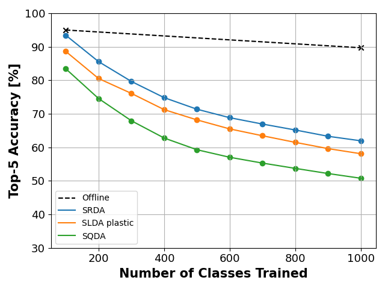

# Deep Streaming Regularized Discriminant Analysis

A Pytorch implementation of our Deep Streaming Regularized Discriminant Analysis (Deep SRDA) algorithm from our [published paper](https://openaccess.thecvf.com/content/ICCV2023W/VCL/html/Khawand_Continual_Learning_with_Deep_Streaming_Regularized_Discriminant_Analysis_ICCVW_2023_paper.html) and [preprint](https://arxiv.org/abs/2309.08353).

Deep SRDA is a generative classification method that combines Quadratic Discriminant Analysis (QDA) and Linear Discriminant Analysis (LDA)
through a regularizing parameter. Combined with a feature extractor, this method can be used as the final layer of CNN to enable Online Continual Learning with a batch size of 1.

## Reproducing our results

To reproduce our results on ImageNet ILSVRC-2012 :

- Download the dataset from [this link](https://github.com/facebook/fb.resnet.torch/blob/master/INSTALL.md#download-the-imagenet-dataset).
- Use our model with a Resenet18 backbone initialized on the first 100 classes following this [repository](https://github.com/tyler-hayes/Deep_SLDA/tree/master).



## Citing

If you use this code please cite us using:

```bibtex
@inproceedings{khawand2023continual,
  title={Continual Learning with Deep Streaming Regularized Discriminant Analysis},
  author={Khawand, Joe and Hanappe, Peter and Colliaux, David},
  booktitle={Proceedings of the IEEE/CVF International Conference on Computer Vision},
  pages={3455--3462},
  year={2023}
}
```
